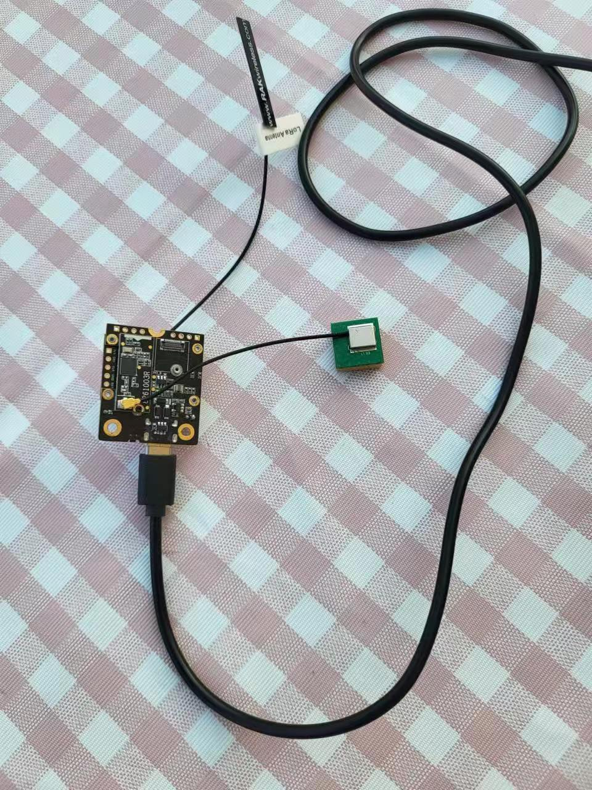

# RUI3_GPS

## Introduction
A simple example for RUI3 that demonstrates how to tokenize and parse NMEA sentences on Wisblock devices with [RAK1910](https://docs.rakwireless.com/Product-Categories/WisBlock/RAK1910/Quickstart/) and [RAK12500](https://docs.rakwireless.com/Product-Categories/WisBlock/RAK12500/Quickstart/). While there are libraries that do that, and well – like the [Sparkfun GNSS library](https://github.com/sparkfun/SparkFun_u-blox_GNSS_Arduino_Library) – doing it your self is a good way to learn how it works. And once you get it to work, it can be a good way to test GNSS modules that may be problematic.

Besides, because RUI3 is bloated, and memory is sparse on RAK3172, examples that work on RAK4631, for example, can't even compile for RAK3172, like the examples of the Sparkfun GNSS library. This one does. It was compiled and tested on a RAK3172.

 

## Recognized sentences.

|Sentence|Meaning|
|---|---|
|xxRMC:|Time and Fix|
|xxGGA:|Time and Fix|
|xxGLL:|Fix|
|xxGSV:|Satellites in view|
|xxGSA:|GPS DOP and active satellites|
|xxTXT:|Course and speed information relative to the ground|

